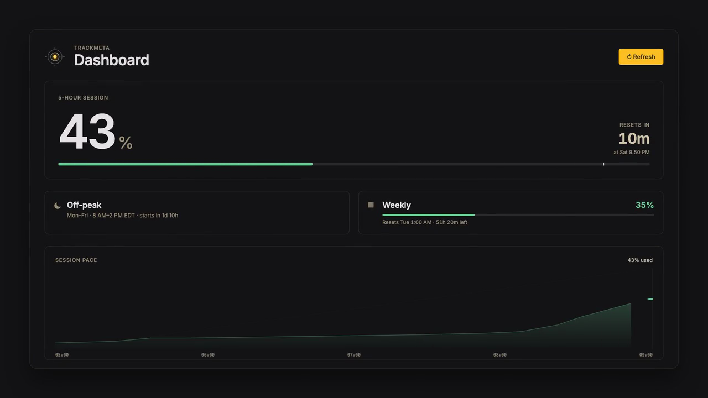
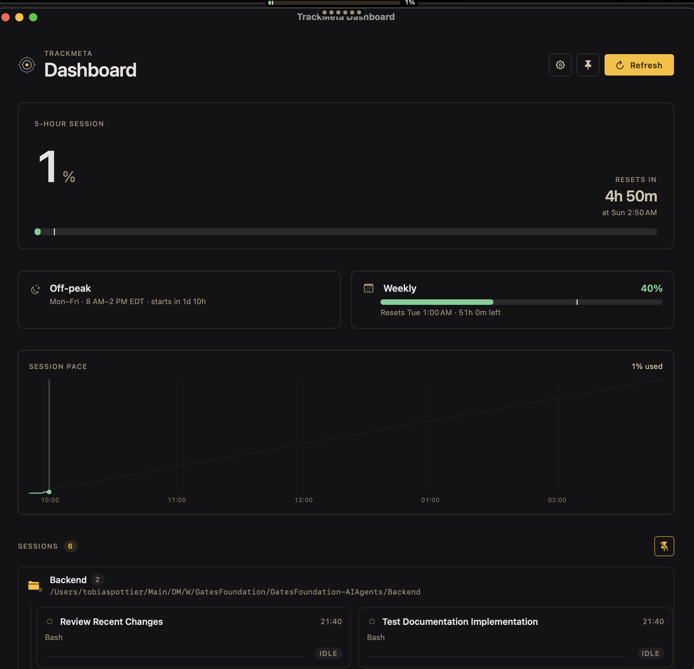
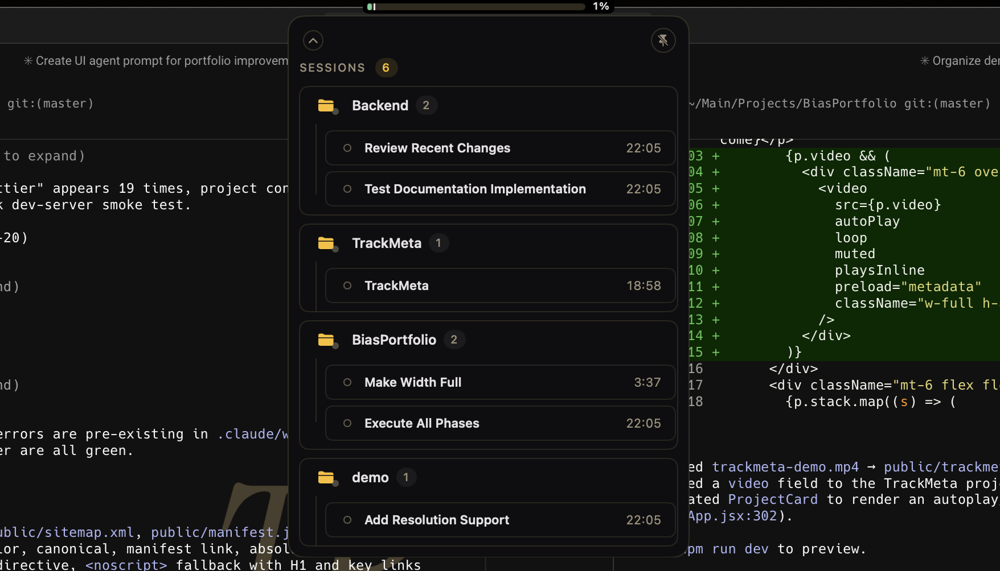

# TrackMeta

macOS menu bar app that shows your Claude Max usage (5-hour session + 7-day) right next to the clock. It reuses the OAuth token that the Claude Code CLI already stores in the macOS Keychain, sends a cheap 1-token request to `api.anthropic.com`, and reads the rate-limit utilization out of the response headers.

The indicator renders as a **notch pill** anchored under the notch on every connected display (a synthetic notch is used on external monitors that don't have one). Click the pill — or press **⌃⌥Space** from anywhere — to open the dashboard. The dashboard plots a 5h-window usage history with Swift Charts, lists peak hours and weekly usage, and shows a read-only **Sessions** panel that groups any locally-running Claude Code sessions by working directory.

TrackMeta is strictly a read-only viewer: it does not start, control, or spawn Claude Code sessions. Session lifecycle belongs to the user's IDE / CLI.

## Demo

[](media/trackmeta-demo.mp4)

> 20-second walkthrough at [`media/trackmeta-demo.mp4`](media/trackmeta-demo.mp4) (1280×720, ~250 KB). GitHub renders inline `<video>` only for files dragged into the web editor, so this README uses a click-through poster instead. The clip is built with [Remotion](https://www.remotion.dev/).

### Dashboard



### Pinned sessions drawer



## Requirements

- macOS 14+
- Xcode 15+
- The Claude Code CLI installed and logged in on this Mac (`claude` in Terminal). TrackMeta reads its OAuth token from the Keychain item `Claude Code-credentials` — it does not store credentials of its own.

## Build & run

```sh
open TrackMeta/TrackMeta.xcodeproj
# ⌘R
```

Or from the command line:

```sh
xcodebuild -project TrackMeta/TrackMeta.xcodeproj -scheme TrackMeta -configuration Debug build
```

On first launch:

1. The TrackMeta pill appears under the notch (or as a status-bar item on displays without a notch / synthetic notch).
2. macOS will prompt once for Keychain access to `Claude Code-credentials`. Click **Always Allow** so subsequent refreshes are silent; "Allow Once" will re-prompt every minute.
3. The pill updates to show your current 5-hour utilization. Click it — or press **⌃⌥Space** from anywhere — to open the dashboard window with both 5h and 7d buckets, reset times, a usage history chart, peak hours, weekly usage, and the live Sessions panel.
4. If a Claude Code sessions server is running on `http://localhost:7777`, the Sessions panel groups each session by `cwd` (status / last tool / summary / context %). If it isn't, the Sessions section stays empty and the usage readout still works.

The usage history chart builds up samples over the current 5h window and rolls over when the window resets.

The dashboard's **Pin** button toggles the window between normal and `.floating` level — pinned, it stays above other apps and persists across launches. There is no separate floating panel; the dashboard itself is the float target.

If requests start failing with 401, your OAuth token expired — run `claude /login` in a terminal, then hit Refresh in TrackMeta.

If Anthropic returns 429 or 439, TrackMeta treats it as a Claude Max usage cap rather than a load failure. The dashboard stays available, the cap is called out without forcing usage to 100%, and live sessions continue to render.

## Why not the public Anthropic API?

Claude **Max** subscription usage isn't exposed by the public Messages / admin APIs. The only way to see it programmatically is to make a real Messages request and read the `anthropic-ratelimit-unified-5h-*` / `anthropic-ratelimit-unified-7d-*` headers. That's what TrackMeta does — one `max_tokens: 1` request per minute. The 1-second session poll is a separate call to `http://localhost:7777`, not an Anthropic API hit.

## Project layout

```
TrackMeta.xcodeproj
TrackMeta/
  TrackMeta.entitlements             sandbox + network.client
  Assets.xcassets/                   app icon
  Sources/
    App/TrackMetaApp.swift           @main; Settings scene + AppDelegate that owns the status item, per-display NotchPillPanels, the global hotkey, and the dashboard window
    Models/
      UsageSnapshot.swift            UsageBucket / UsageSnapshot / UsageLoadState / sessionProgress
      ClaudeSession.swift            live Claude Code session model (status / lastTool / lastToolTarget / cwd / summary / contextPercentage)
      PeakHours.swift
    Services/
      ClaudeCredentialsStore.swift   reads Keychain → claudeAiOauth.accessToken
      ClaudeUsageClient.swift        POST /v1/messages; snapshot from headers; 429/439 preserves last utilization
      ClaudeSessionClient.swift      GET http://localhost:7777; polled every 1s
      GlobalHotkey.swift             Carbon ⌃⌥Space → toggle dashboard
      UsageHistoryStore.swift        UserDefaults-backed sample buffer ("usageHistory.v1")
      SessionHistoryStore.swift      per-session events / activity buckets / first-seen time (pure ingestion)
    ViewModels/
      UsageViewModel.swift           @Observable; 60s usage refresh + 1s session poll; owns session histories, expansion state, sessionsPinned, unifiedFolderGroups
    Views/
      DesignSystem.swift             "Modern Refinement" tokens (DS.Surface / DS.Text / DS.Primary / DS.Outline) — near-black surface, amber accent
      MenuBarLabel.swift             fallback status-bar indicator (used on displays without a notch)
      UsagePopover.swift             popover content used inside the notch pill / dashboard
      DashboardView.swift            single-pane dashboard window: header, hero, meta row, chart, Sessions card; header has Settings / Pin / Refresh
      ProjectFoldersPanel.swift      read-only Sessions panel: groups live sessions by cwd
      SessionTile.swift              per-agent tile (collapsed / expanded), ActivitySparkline of per-minute event counts
      SessionVisuals.swift           shared SessionStatusPalette + PulsingDot
      SettingsView.swift             Settings scene body; FloatingWindowConfigurator raises above .statusBar
      TrackerLogo.swift              brand mark
TrackMetaTests/                      unit tests
TrackMetaUITests/                    UI tests
```

Data flow is one-way: Keychain → `ClaudeUsageClient` → `UsageViewModel` (`UsageLoadState`) → SwiftUI views.

## Tests

```sh
xcodebuild -project TrackMeta/TrackMeta.xcodeproj -scheme TrackMeta \
  -destination 'platform=macOS' test
```

Single test:

```sh
xcodebuild ... test -only-testing:TrackMetaTests/TrackMetaTests/<methodName>
```

## Notes

- The app is an `LSUIElement` agent — no Dock icon. The Dock icon only appears while the dashboard window is open, and the app drops back to `.accessory` as soon as it closes.
- Sandbox stays on; the only entitlement granted beyond the sandbox itself is `com.apple.security.network.client` (reaches `api.anthropic.com` and `localhost:7777`).
- Auth state is never stored by TrackMeta — it lives in the Claude Code CLI's Keychain item. TrackMeta persists a few small UserDefaults keys for UX state: `usageHistory.v1` (rolling 5h sample buffer), `TrackMeta.sessionsPinned` + `TrackMeta.sessionsPinnedCollapsed` (notch-drawer toggles), and `TrackMeta.dashboardPinned` (dashboard window stays floating).
- ⌃⌥Space is registered process-wide via Carbon; it toggles the dashboard whether or not TrackMeta is frontmost.
